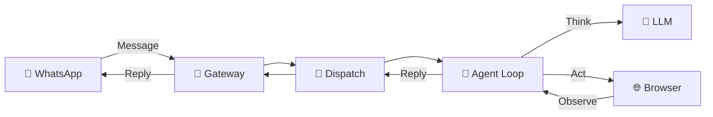

<p align="center">
  
</p>

<h1 align="center">BrowseBot</h1>

<p align="center">
  <strong>🧠 AI-Powered Browser Automation — Controlled via WhatsApp</strong>
</p>

<p align="center">
  Send a WhatsApp message → AI browses the web for you → Get results back in chat.
</p>

<p align="center">
  <a href="#-quick-start"></a>
  <a href="#-demo"></a>
  <a href="#-architecture"></a>
</p>

<p align="center">
  
  
  
  
  
  
</p>

---

## 🤔 What is BrowseBot?

**BrowseBot** is a self-hosted AI agent that you control entirely through WhatsApp. It runs a real Chrome browser behind the scenes using Playwright, understands your natural language instructions, and performs web tasks autonomously — shopping, researching, comparing products, filling forms, and more.

> **Think of it as having a personal assistant that can browse the internet for you, all from a WhatsApp conversation.**

### Why BrowseBot?

- 🚫 **No cloud dependency** — runs on your machine, your data stays private
- 💬 **WhatsApp-native** — no new apps to install, just text your bot
- 🧠 **Multi-AI brain** — choose from Claude, Gemini, or Groq (with automatic fallback)
- 🌐 **Real browser** — not an API simulator, an actual Chrome browser that sees what you'd see
- 🔌 **Plugin-ready architecture** — designed from day one for easy extensions

---

## ✨ Features

<table>
<tr>
<td width="50%">

### 💬 Natural Language Control
Send plain English messages on WhatsApp. No commands to memorize — just describe what you want.

*"Go to Amazon and find the best laptop under ₹50,000 with good reviews"*

</td>
<td width="50%">

### 🌐 Real Browser Automation
13 built-in tools powered by Playwright — click, type, scroll, navigate, take screenshots, extract data, and manage tabs in a real Chrome browser.

</td>
</tr>
<tr>
<td width="50%">

### 🤖 Multi-Provider AI
Supports **Anthropic Claude**, **Google Gemini**, and **Groq** with automatic provider chain fallback. If one fails, it seamlessly switches to the next.

</td>
<td width="50%">

### 📸 Smart Page Understanding
Uses accessibility snapshots (ARIA tree) instead of screenshots for 100x more efficient page understanding. Screenshots only when visual verification is needed.

</td>
</tr>
<tr>
<td width="50%">

### 🔀 Multi-Tab Browsing
Open multiple tabs to compare products side-by-side, just like you would. Each tab is tracked and switchable.

</td>
<td width="50%">

### 🔑 Secure by Design
Credential vault for site logins, per-user browser isolation, safety rules that prevent unauthorized payments, and session persistence with cookies.

</td>
</tr>
<tr>
<td width="50%">

### 🧠 Persistent Memory
Conversation history, user preferences, and browsing activity survive bot restarts. Powered by SQLite — the bot remembers you across sessions without needing re-context every time.

</td>
<td width="50%">

### ⚡ Smart Context Injection
User preferences and recent activity are **automatically injected** into the LLM system prompt at the start of every session — no tool call needed. The AI knows your context before you say a word.

</td>
</tr>
</table>

---

## 🎬 Demo

```
You:      Find me the best wireless earbuds under ₹3000 on Flipkart
BrowseBot: 🔍 On it...

BrowseBot: 🎧 Top 3 Wireless Earbuds Under ₹3,000:

           1. boAt Airdopes 141 — ₹1,299 ⭐ 4.1/5 (284K reviews)
              ✅ 42hr battery | IPX4 | BEAST Mode
              
           2. Noise Buds VS104 — ₹1,099 ⭐ 4.0/5 (152K reviews)  
              ✅ 45hr battery | Instacharge | hyper sync
              
           3. realme Buds T110 — ₹1,299 ⭐ 4.2/5 (89K reviews)
              ✅ 38hr battery | AI ENC | 12.4mm drivers

           💡 Recommendation: boAt Airdopes 141 — best balance of
           price, battery, and verified buyer reviews.
```

---

## 🚀 Quick Start

### Prerequisites

| Requirement | Version |
|---|---|
| **Node.js** | >= 22.0.0 |
| **pnpm** | Latest (`npm install -g pnpm`) |
| **AI API Key** | At least one: [Anthropic](https://console.anthropic.com/) / [Google AI](https://aistudio.google.com/apikey) / [Groq](https://console.groq.com/) |

### Installation

```bash
# Clone the repository
git clone https://github.com/JaiminBhojani/browserbot.git
cd browserbot

# Install dependencies
pnpm install

# Copy and configure environment
cp .env.example .env
# Edit .env with your API key(s)

# Start the bot
pnpm dev
```

### Connect WhatsApp

1. A **QR code** will appear in your terminal
2. On your phone: **WhatsApp** → **Settings** → **Linked Devices** → **Link a Device**
3. Scan the QR code
4. Send a message — BrowseBot will reply! 🎉

> **Note:** Session is saved to `~/.browsbot/whatsapp-session/` — you only need to scan once. On restart, it auto-reconnects.

---

## ⚙️ Configuration

### Environment Variables (`.env`)

```env
# Gateway
BROWSBOT_PORT=18789
BROWSBOT_AUTH_TOKEN=your-secret-token

# AI Providers — set at least ONE
GOOGLE_API_KEY=your-google-api-key        # Free tier: 250K tokens/min
ANTHROPIC_API_KEY=your-anthropic-api-key   # Best quality
GROQ_API_KEY=your-groq-api-key            # Fastest inference (free tier)

# WhatsApp
WHATSAPP_ENABLED=true
WHATSAPP_ALLOWED_NUMBERS=+91XXXXXXXXXX    # Comma-separated, leave empty for all

# Browser
BROWSER_HEADLESS=true

# Logging
LOG_LEVEL=info
```

### Config File (`~/.browsbot/browsbot.json`)

For advanced configuration, create a JSON config file. Environment variables override config file values.

```json
{
  "providers": {
    "primary":   { "provider": "google",    "model": "gemini-2.5-flash" },
    "fallback":  { "provider": "anthropic", "model": "claude-haiku-4-5-20251001" },
    "fallback2": { "provider": "groq",      "model": "llama-3.3-70b-versatile" }
  },
  "browser": {
    "headless": true,
    "maxContexts": 5
  },
  "channels": {
    "whatsapp": {
      "enabled": true,
      "allowedNumbers": ["+91XXXXXXXXXX"]
    }
  }
}
```

---

## 💬 WhatsApp Commands

| Command | Description |
|---|---|
| `/help` | Show all available commands |
| `/status` | Bot uptime, memory usage, Node version |
| `/ping` | Quick health check |
| `/reset` | Clear conversation history |
| *Any message* | Natural language → AI agent processes it |

---

## 🏗️ Architecture

BrowseBot follows a **gateway-centric modular monolith** pattern with clear separation of concerns:

```
                    ┌──────────────────────────────────────────────────────────┐
                    │                    Gateway Server                        │
                    │              HTTP + WebSocket (:18789)                   │
                    ├────────────┬────────────┬────────────┬──────────────────┤
                    │  Channel   │   Agent    │  Browser   │     Infra        │
                    │   Layer    │   Brain    │  Engine    │                  │
                    │            │            │            │                  │
                    │  WhatsApp  │  Claude    │ Playwright │  Config (Zod)   │
                    │  (Baileys) │  Gemini    │ 13 Tools   │  Hook Engine    │
                    │            │  Groq      │ Snapshot   │  Pino Logger    │
                    │  +Telegram │  +OpenAI   │ Tabs       │  Plugins        │
                    │  +Slack    │  +Ollama   │ Cookies    │  Security       │
                    │  +Discord  │            │ Vault      │                  │
                    └────────────┴────────────┴────────────┴──────────────────┘
```

### Message Flow (Simplified)



### How a message flows through the system:

1. **WhatsApp** → User sends *"Find laptops under ₹50k on Amazon"*
2. **Baileys Adapter** → Receives raw message, filters (skip own msgs, broadcasts), converts to `UnifiedMessage`
3. **Gateway** → Routes to dispatch pipeline, wires up `sendReply` function
4. **Dispatch** → Loads conversation history **from SQLite**, sends "🔍 On it...", calls agent
5. **Agent Loop** → Builds system prompt: `IDENTITY + BROWSING + SAFETY + 🆕 Memory Context` (preferences + recent activity auto-injected per user)
6. **LLM** → AI decides: "I should navigate to amazon.in and search"
7. **Tool Registry** → Dispatches `browser_navigate`, `browser_snapshot`, `browser_click`, `browser_type`...
8. **Browser Engine** → Playwright executes each action in user's isolated browser context
9. **Agent Loop** → AI sees page snapshot, extracts data, decides next step (up to 25 iterations)
10. **Reply** → Final response sent back through dispatch → **history saved to SQLite** → WhatsApp → user

### Key Design Decisions

| Decision | Rationale |
|---|---|
| **ARIA Snapshots over Screenshots** | 100x smaller than screenshots (~3K vs 300K tokens), gives structured data the AI can act on |
| **Provider Chain (not single provider)** | Auto-fallback: if Claude hits rate limit → try Gemini → try Groq |
| **Per-user Browser Contexts** | Complete isolation — User A's Amazon login never leaks to User B |
| **Ref-based Element Targeting** | More reliable than CSS selectors; AI sees `[ref=e5]` in snapshot, uses it to click |
| **Context Guard** | Proactively compacts history to prevent token overflow during long sessions |
| **SQLite Memory (per user)** | History + preferences survive restarts; auto-injected into system prompt — LLM has full context from message 1 |
| **Modular Monolith** | Single process for simplicity, but module boundaries designed for future microservice extraction |

---

## 🔧 Browser Engine — 13 Built-in Tools

| Tool | What It Does |
|---|---|
| `browser_navigate` | Navigate to any URL with configurable wait strategies |
| `browser_snapshot` | Accessibility tree with ref IDs — primary page understanding |
| `browser_click` | Click by ref ID, CSS selector, text, or coordinates |
| `browser_type` | Type into input fields with optional clear |
| `browser_scroll` | Scroll page or specific containers |
| `browser_select` | Select dropdown options by value or label |
| `browser_wait` | Wait for elements, network idle, or fixed delay |
| `browser_back` | Browser history navigation |
| `browser_screenshot` | JPEG viewport or full-page capture |
| `browser_extract` | Structured extraction: prices, reviews, DOM elements |
| `browser_tab_new` | Open a new browser tab |
| `browser_tab_switch` | Switch between open tabs |
| `browser_tab_close` | Close the current tab |

### Supporting Infrastructure

- **Browser Pool** — Shared Chromium instance, lazy-launched on first request
- **Context Manager** — Per-user isolated browser contexts with session persistence
- **Lifecycle Manager** — Automatic idle timeout and max context limits
- **Tab Router** — Multi-tab support with active tab tracking per user
- **Cookie Store** — Persistent cookies via SQLite
- **Credential Vault** — Encrypted credential storage for site logins
- **Ref Store** — Per-user element reference mapping for snapshot-based targeting

---

## 📁 Project Structure

```
src/
├── index.ts                          # Entry point
├── gateway/
│   ├── server.ts                     # 10-step startup orchestrator
│   ├── server-http.ts                # Express routes (/health, /api/status)
│   └── server-ws.ts                  # WebSocket for real-time clients
├── channels/
│   ├── base/
│   │   ├── channel.interface.ts      # Channel contract
│   │   ├── channel-registry.ts       # Channel manager
│   │   └── message.types.ts          # UnifiedMessage, OutboundMessage
│   └── whatsapp/
│       ├── whatsapp-adapter.ts       # Baileys integration
│       └── in-memory-store.ts        # Chat/contact cache
├── agent/
│   ├── runner/agent-loop.ts          # Think → Act → Observe (max 25 iters)
│   ├── providers/
│   │   ├── base.ts                   # LLMProvider interface
│   │   ├── factory.ts                # Provider chain builder
│   │   ├── anthropic.ts              # Claude SDK
│   │   ├── google.ts                 # Gemini SDK
│   │   └── groq.ts                   # Groq SDK
│   ├── memory/
│   │   ├── memory-db.ts              # SQLite singleton (3-table schema)
│   │   └── memory-store.ts           # MemoryStore — conversations, preferences, searches
│   ├── prompt/templates/
│   │   ├── IDENTITY.md               # Bot personality
│   │   ├── BROWSING.md               # Browser strategy
│   │   └── SAFETY.md                 # Safety rules
│   ├── tools/registry.ts            # Agent ↔ Browser bridge
│   └── context-guard.ts             # Token management
├── browser/
│   ├── index.ts                      # BrowserEngine facade
│   ├── pool/                         # Browser pool, contexts, lifecycle
│   ├── actions/                      # click, type, scroll, navigate
│   ├── snapshot/                     # ARIA tree + ref IDs
│   ├── tabs/                         # Tab mgmt + cookies
│   ├── tools/index.ts               # 13 tool definitions
│   ├── extraction/                   # Price/review/DOM extraction
│   ├── vision/                       # Screenshot capture
│   └── auth/                         # Credential vault
├── auto-reply/
│   ├── dispatch.ts                   # Message → agent routing (DB-backed history)
│   └── command-registry.ts           # Slash commands
├── hooks/hook-engine.ts             # 12 lifecycle hooks
├── config/
│   ├── io.ts                         # Load/save config
│   └── schema.ts                     # Zod validation
├── infra/logger.ts                  # Pino structured logging
├── plugins/                          # 🔲 Plugin system (planned)
└── security/                         # 🔲 Security layer (planned)
```

---

## 🔌 Extensibility — Add Your Own Channel or AI Provider

BrowseBot's architecture is designed for easy extension. Every major subsystem plugs in through a clean interface.

### Add a New Channel (e.g. Telegram)

```typescript
// 1. Create src/channels/telegram/telegram-adapter.ts
import type { Channel } from '../base/channel.interface.js';

export class TelegramChannel implements Channel {
  readonly type = 'telegram' as const;
  readonly name = 'Telegram';
  // ... implement connect(), sendMessage(), onMessage()
}

// 2. Register in gateway/server.ts
const telegram = new TelegramChannel(config.channels.telegram);
channelRegistry.register(telegram);
```

### Add a New LLM Provider (e.g. OpenAI)

```typescript
// 1. Create src/agent/providers/openai.ts
import { LLMProvider } from './base.js';

export class OpenAIProvider implements LLMProvider {
  readonly name = 'openai';
  // ... implement complete()
}

// 2. Add one line in factory.ts
case 'openai': return new OpenAIProvider(config);
```

### Add a New Browser Tool

```typescript
// Just add to browser/tools/index.ts
export const browserMyTool: BrowserTool = {
  name: 'browser_my_tool',
  description: 'Does something cool',
  parameters: { /* ... */ },
  async execute(params, ctx) { /* ... */ },
};

// Add to the array — agent can immediately use it
ALL_BROWSER_TOOLS.push(browserMyTool);
```

---

## 🛠️ Development

```bash
pnpm dev          # Start with live reload (tsx watch)
pnpm build        # Production build (tsdown)
pnpm start        # Run production build
pnpm test         # Run tests (Vitest)
pnpm test:watch   # Tests in watch mode
pnpm lint         # Lint (oxlint)
pnpm typecheck    # TypeScript type checking
```

---

## 🧰 Tech Stack

| Category | Technology | Why |
|---|---|---|
| **Runtime** | Node.js 22+ | Latest LTS with native ESM |
| **Language** | TypeScript 5.7 | Type safety across the entire stack |
| **Browser** | Playwright | Most reliable browser automation |
| **WhatsApp** | Baileys v7 | Multi-device, no Business API needed |
| **AI** | Anthropic / Google AI / Groq SDKs | Multi-provider flexibility |
| **Web Server** | Express 5.1 | Lightweight HTTP layer |
| **WebSocket** | ws | Real-time client communication |
| **Validation** | Zod | Runtime config validation |
| **Database** | better-sqlite3 | Cookie, credential & **persistent memory** storage (`memory.db`) |
| **Logging** | Pino + pino-pretty | Structured, fast logging |
| **Build** | tsdown | Fast ESM bundling |
| **Testing** | Vitest | Modern, fast test runner |
| **Linting** | oxlint | Blazing fast linter |

---

## 📋 Roadmap

- [x] **Phase 1 — Foundation**
  - Gateway server (HTTP + WebSocket)
  - Zod-validated configuration system
  - WhatsApp channel via Baileys with QR auth
  - Command registry & message dispatch
  - Hook engine with 12 lifecycle events

- [x] **Phase 2 — Browser Engine**
  - Playwright browser pool with context isolation
  - 13 browser tools (navigate, click, type, scroll, select, wait, back, screenshot, extract, read, tabs)
  - ARIA accessibility snapshot system with ref IDs
  - Tab management, cookie persistence, credential vault

- [x] **Phase 3 — Agent Brain**
  - Multi-provider LLM integration (Anthropic, Google, Groq)
  - Provider chain with automatic fallback
  - Agent loop (think → act → observe, max 25 iterations)
  - System prompt templates & tool dispatch
  - Context guard (token estimation, history compaction)

- [x] **Phase 4 — Intelligence**
  - [x] Persistent conversation memory (SQLite — `~/.browsbot/memory.db`)
  - [x] User preferences & browsing history across sessions
  - [x] Auto memory context injection into every agent session
  - [x] Self-pruning DB (capped via `maxHistory` — never grows unbounded)
  - [ ] Vision-based page understanding
  - [ ] Multi-step task planning & orchestration

- [ ] **Phase 5 — Security & Hardening**
  - Action approval pipeline for sensitive operations
  - Payment & transaction guards
  - Rate limiting, sandboxing, domain blocklists

- [ ] **Phase 6 — Extensibility**
  - npm-based plugin system
  - Custom hooks & event handlers
  - Web-based dashboard UI
  - Additional channels (Telegram, Slack, Discord)

---

## 🤝 Contributing

Contributions are welcome! Here's how to get started:

1. **Fork** the repository
2. **Create** a feature branch: `git checkout -b feature/amazing-feature`
3. **Commit** using [Conventional Commits](https://www.conventionalcommits.org/): `git commit -m "feat: add amazing feature"`
4. **Push** to the branch: `git push origin feature/amazing-feature`
5. **Open** a Pull Request

### Good First Issues

- Add a new LLM provider (OpenAI, Ollama)
- Add a new Channel adapter (Telegram, Discord)
- Improve extraction accuracy for specific sites
- Add more browser tools (file upload, drag-and-drop)

---

## ⭐ Star History

If you find this project useful, please consider giving it a ⭐ — it helps others discover it!

---

## 📄 License

This project is licensed under the [MIT License](LICENSE).

---

<p align="center">
  Built with ❤️ by <a href="https://github.com/JaiminBhojani">Jaimin Bhojani</a>
</p>

<p align="center">
  <a href="https://github.com/JaiminBhojani/browserbot/stargazers">⭐ Star this repo</a> •
  <a href="https://github.com/JaiminBhojani/browserbot/issues">🐛 Report Bug</a> •
  <a href="https://github.com/JaiminBhojani/browserbot/issues">💡 Request Feature</a>
</p>